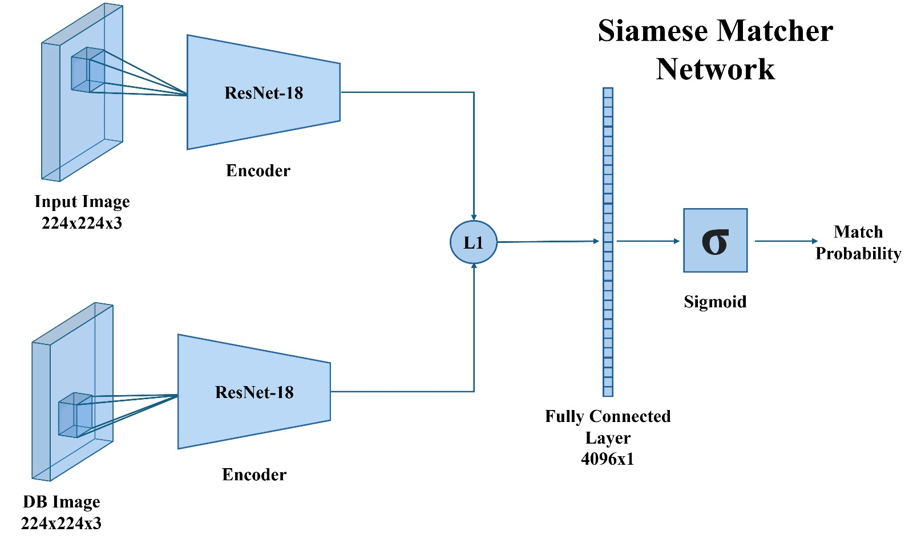

# Smart_Attendance_Face_Recognition
## Introduction

Modernizing attendance tracking, this project integrates AI and computer vision into the attendance process. By combining face detection and recognition, the system can accurately identify and log attendees, providing an efficient and convenient alternative to traditional methods.

## Installation

1. Clone this repository: `git clone https://github.com/LoaiMB/Smart_Attendance_Face_Recognition-.git`
2. Navigate to the project directory: `cd Smart_Attendance_Face_Recognition`
3. Create new virtual environment: `python -m venv venv` (Windows) or `python3 -m venv venv` (Linux/macOS)
4. Activate the venv: `venv\Scripts\activate` (Windows) or `source venv/bin/activate` (Linux/macOS) 
5. Install the required dependencies: `pip install -r requirements.txt`

### Data Collection

To start, run the `collect.py` script. This script employs the MediaPipe face detection model to identify faces in frames, which are then cropped and organized into separate folders per individual. This dataset will serve as the basis for inferencing the face recognition model. Note: Remember to add your employee names to the list variable named "employee_names" in collect.py code. As a start, you can collect 5-10 images per person with a variety of angles and poses.

### Model Architecture 

  

 
<!-- Insert your project logo if available -->

### Model Traning 
Run `train.py` to train the model for face recognition on the LFW dataset. Note: this code uses `data.py` which preprocess the data and organizes it before training. 
### Model Inferencing 
For live infrence run the `inference.py` code. 
